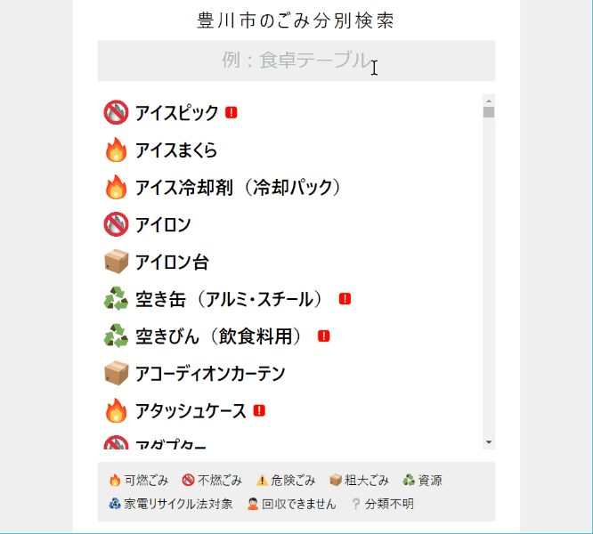

#  Gomipedia

家庭ごみ・資源の分別方法をキーワード検索できるウェブアプリです。  
各市町村のウェブサイトにて公開されている分別情報を元にしています。

### ⚠利用に当たっての注意事項

* 本ウェブアプリは個人が趣味で製作したものです。(各市町村と直接の関係はありません)
* 本ウェブアプリの利用に起因するトラブルに関して製作者は一切の責任を負いません。
* 本ウェブアプリは予告なく公開を停止する場合があります。
* 本ウェブアプリに関するお問い合わせは suconbu@gmail.com へお寄せください。

### 操作風景

### 変更履歴

| 日付       | 変更内容                                            |
| ---------- | --------------------------------------------------- |
| 2023-03-05 | 各自治体の分別データを2023年3月5日時点のものに更新  |
| 2022-08-24 | 各自治体の分別データを2022年8月24日時点のものに更新 |
| 2022-08-24 | 一宮市を除外 (pdf化によりデータ取得不可)            |
| 2022-08-21 | 瀬戸市に対応                                        |
| 2020-05-10 | 安城市に対応                                        |
| 2020-05-09 | 豊橋市に対応                                        |
| 2020-05-08 | 一宮市に対応                                        |
| 2020-04-13 | 豊田市に対応                                        |
| 2020-04-06 | 岡崎市に対応                                        |
| 2020-03-28 | 名古屋市に対応                                      |
| 2020-03-23 | ひらがなでの検索に対応                              |
| 2020-03-21 | 初版 (豊川市に対応)                                 |

### ライセンス

このリポジトリの内容には MIT License を適用します。

### 関連リポジトリ

* アイコン画像  
https://github.com/twitter/twemoji  

* 分別データフォーマット仕様・分別データ取得プログラム  
https://github.com/suconbu/gomidata  
